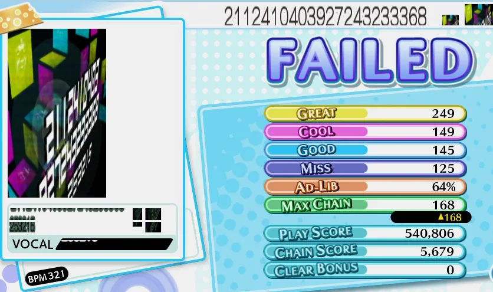
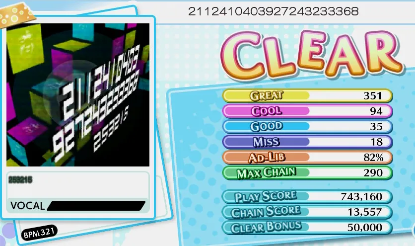
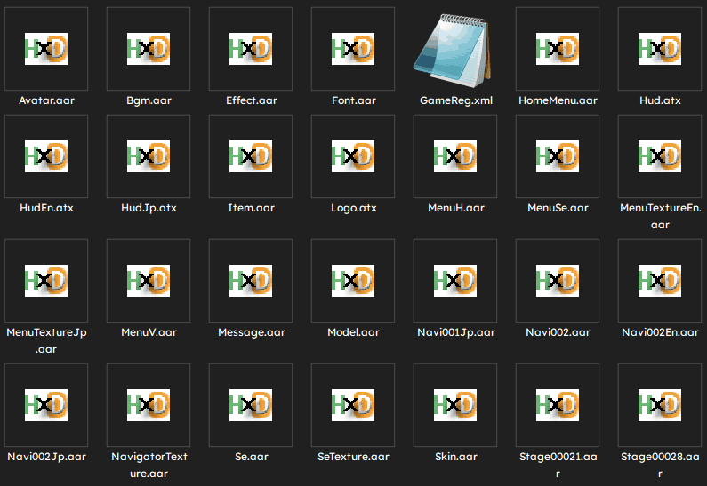
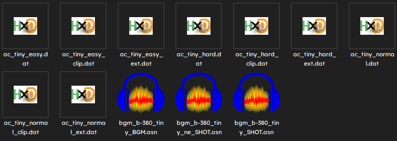
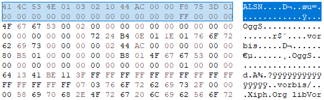

# Mod The Coaster
Groove Coaster modding utilities.

# Tools (SWITCH)
## Jacket Convert
Converts AC jackets to SW jackets. SW uses a different jacket layout than other versions, and jackets will look stretched unless converted.

|Before                              |After                               |
|------------------------------------|------------------------------------|
|||

# Tools (STEAM)
## AAR Zip
Packs `.aar` archives. ST stores most of its files (including charts) in `.aar` files.

|List                                    |Unpacked                                  |
|----------------------------------------|------------------------------------------|
|||

## ASN Snip
Converts `.asn` audio to `.ogg` by trimming header. ST stores its audio in `.asn` files, which are just `.ogg` audio files with a 32 byte header. **ST will accept standard `.ogg` the same as `.asn`.**

